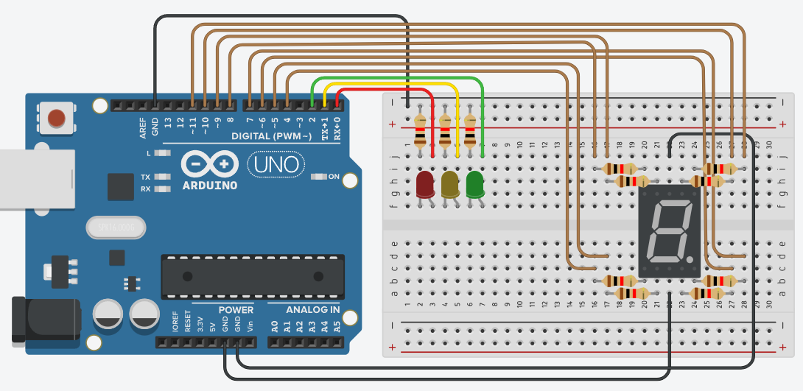

# Semáforo em Rust para Arduino

Este projeto é um semáforo implementado em Rust para o Arduino Uno R3, demonstrando como controlar LEDs para simular um semáforo de trânsito.

## Pré-requisitos

Antes de começar, certifique-se de que você tem o seguinte instalado:

- Rust e Cargo (com o canal nightly configurado)
- AVR Toolchain (avr-gcc, avr-libc)
- AVRDUDE

## Configuração do Projeto

Para configurar o projeto em seu ambiente local, siga estes passos:

1. Clone o repositório do projeto.
2. Navegue até a pasta do projeto.

## Compilação

Para compilar o projeto, execute o seguinte comando no terminal:

```bash
cargo build --release
```

## Carregando no Arduino

Após a compilação, você pode carregar o binário no Arduino com o seguinte comando:

```bash
avrdude -p m328p -c arduino -P {{USB_DO_ARDUINO}} -b 115200 -D -U flash:w:target/avr-atmega328p/release/traffic-light.elf
```
